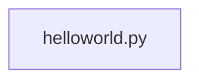

## Architecture Documentation: Hello World Application

This document outlines the architecture of a simple "Hello World" application.  Due to the minimal nature of the application (single Python file, no external dependencies), many sections will be brief or inapplicable.

**1. System Overview**

The Hello World application is a standalone Python script designed to print the message "Hello World!" to the console. It has no external dependencies, databases, APIs, or authentication mechanisms.  The primary goal is to demonstrate a basic "Hello World" functionality.

**2. Component Architecture**

The application consists of a single component:

* **helloworld.py:** This Python script contains the core logic, printing the "Hello World!" message.

**3. Data Flow**

There is no significant data flow within the application. The script directly prints a hardcoded string to the standard output (console).

**4. Key Design Decisions**

* **Simplicity:** The design prioritizes simplicity and ease of understanding.  This is a minimal viable product (MVP) for demonstrating a basic function.
* **No External Dependencies:**  No external libraries or frameworks are used, making it highly portable and easy to deploy.
* **Single File:** The entire application is contained within a single Python file.

**5. Module Interactions**

The application consists of only one module (`helloworld.py`), thus there are no module interactions.

**6. Security Architecture**

Given the application's minimal functionality and lack of external interactions, a formal security architecture is not necessary.  There are no security considerations at this stage.

**7. Deployment Architecture**

Deployment is straightforward.  The `helloworld.py` file can be copied to any system with a Python interpreter and executed using the command `python helloworld.py`.  No specific deployment infrastructure is required.

**Future Considerations:**

If this project were to evolve, the following aspects would need to be addressed:

* **Error Handling:** Implement robust error handling to gracefully manage potential issues.
* **External Dependencies:**  If additional features are added, external libraries might be needed, requiring dependency management and version control.
* **Testing:** Unit and integration tests should be implemented to ensure code quality and reliability.
* **Modularization:**  For larger projects, the code should be broken down into smaller, more manageable modules.
* **API Integration (If Applicable):** If the application were to interact with external systems, an API would be required, necessitating considerations for API design, security, and scalability.
* **Database Integration (If Applicable):**  If data persistence is needed, a database integration would be required, including database selection, schema design, and data access layer implementation.
* **Authentication and Authorization (If Applicable):**  If user authentication and authorization are needed, security protocols and mechanisms would be required.

This documentation provides a comprehensive overview of the current, minimal "Hello World" application.  It will require significant expansion as the application evolves.
