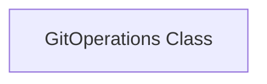
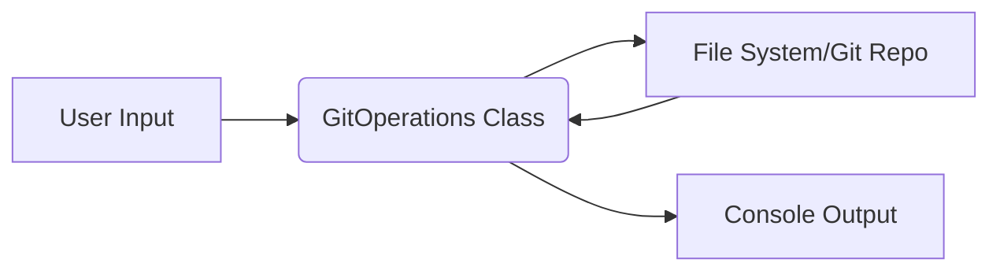

## Architecture Documentation: Git Operations Utility

This document outlines the architecture of a simple Git operations utility, based on the provided project analysis and code structure.  The utility lacks a formal API, database, authentication, or testing framework at this stage.  Future iterations may incorporate these features.

**1. System Overview**

The Git Operations utility is a command-line tool designed to perform basic Git-related tasks.  Currently, its functionality is limited to operations within a local Git repository.  It does not interact with remote repositories (e.g., GitHub) directly at this stage, although the code suggests a potential future extension for such capabilities.  The system operates locally, processing commands and performing actions within the file system.

**2. Component Architecture**

The system comprises a single core component:

The `GitOperations` class encapsulates all functionality.  Future expansion might lead to a more modular architecture.

**3. Data Flow**

The data flow is straightforward:

1. **Input:**  The utility (likely through command-line arguments, not implemented yet) receives instructions specifying the Git operation to perform.
2. **Processing:** The `GitOperations` class processes the instruction, interacting directly with the local file system and the Git repository located in a specified directory.
3. **Output:** The result of the operation (success/failure, messages, etc.) is printed to the console.

**4. Key Design Decisions**

* **Single Class Design:**  Given the current limited scope, a single class design was chosen for simplicity.  This is subject to refactoring as the project expands.
* **Local Repository Focus:**  The initial implementation focuses solely on local Git repositories. Integration with remote repositories is planned for future development.
* **No External Dependencies (Besides GitPython):**  The design minimizes external dependencies beyond the core `gitpython` and `github` libraries, promoting simplicity and maintainability.  However, the `github` dependency isn't currently used.
* **Lack of Error Handling (as shown):** The provided code snippet doesn't include robust error handling. This is a critical area requiring attention in future iterations.

**5. Module Interactions**

The only module is `src/git_operations.py`, containing the `GitOperations` class.  There are no inter-module interactions at present.

**6. Security Architecture**

No specific security architecture is implemented.  As the system currently lacks authentication and operates locally, security considerations are minimal at this stage.  However, future extensions, especially those involving remote repository access, will require a comprehensive security architecture, including authentication and authorization mechanisms.

**7. Deployment Architecture**

Currently, the deployment architecture is trivial. The `git_operations.py` script can be executed directly from the command line after installing necessary dependencies (`pip install gitpython`).  Future deployments might involve packaging the script as an executable or integrating it into a larger system.  No deployment infrastructure is currently envisioned.

**Future Considerations:**

* **Robust Error Handling:** Implement comprehensive error handling and exception management.
* **Command-Line Interface (CLI):**  Develop a user-friendly CLI for interacting with the utility.
* **Remote Repository Support:**  Add functionality to interact with remote Git repositories (GitHub, GitLab, etc.).
* **Modular Design:**  Refactor the code into smaller, more manageable modules.
* **Testing:** Implement a comprehensive test suite.
* **Authentication and Authorization:** If remote repository interaction is added, robust security mechanisms will be necessary.

This documentation serves as a starting point.  As the project evolves and new features are added, this document should be updated accordingly.
